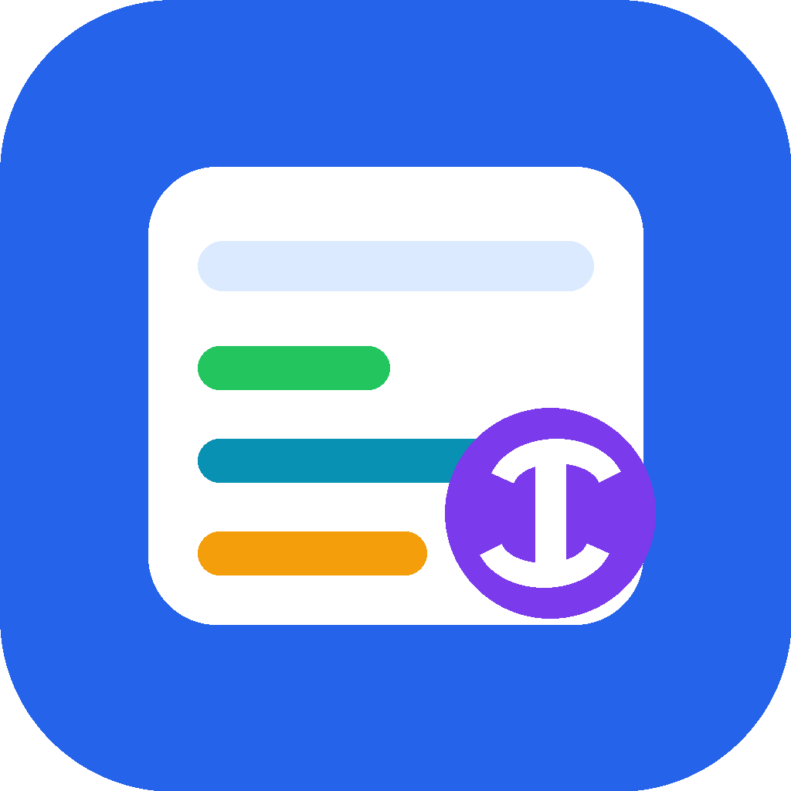

<p align="center">
  
</p>

<h1 align="center">Presupuesto Mensual</h1>

<p align="center">
  Aplicacion de escritorio para gestionar sueldo mensual, gastos fijos, ocio y ahorro de forma simple, visual y local.
</p>

<p align="center">
  
  
  
  
</p>

---

## Descripcion del Proyecto

Presupuesto Mensual nacio como reemplazo de una planilla Excel personal para administrar ingresos, gastos fijos, ocio y ahorro mes a mes.

La aplicacion permite registrar sueldo mensual variable, marcar gastos fijos como pagados, anotar gastos de ocio diarios y llevar un control del ahorro mensual y acumulado anual. Todo funciona de manera local con SQLite, sin servidor ni conexion a internet.

El objetivo es tener una herramienta sencilla, ordenada y visual para revisar rapidamente cuanto dinero queda disponible, cuanto se ha gastado y como avanza el ahorro.

## Caracteristicas

- Dashboard con sueldo, disponible real, ocio disponible y ahorro anual.
- Registro mensual de gastos fijos pagados.
- Registro diario de ocio y compras.
- Registro de ahorro mensual y acumulado anual.
- Meses independientes: puedes avanzar o retroceder sin perder historial.
- Base de datos local con SQLite.
- Interfaz adaptable para pantallas grandes y pequenas.
- Icono propio para la ventana y el ejecutable.
- Generador de `.exe` para compartir en Windows.

## Vista general

La aplicacion usa Python, Tkinter y SQLite. No necesita servidor ni internet para funcionar.

```text
Presupuesto_mensual/
|-- presupuesto_app.py
|-- assets/
|   |-- app_icon.ico
|   |-- app_icon.png
|   `-- app_icon.svg
|-- presupuesto/
|   |-- app.py
|   |-- store.py
|   |-- dialogs.py
|   |-- utils.py
|   `-- constants.py
|-- scripts/
|   `-- generate_icon.py
|-- docs/
|-- build_exe.bat
|-- verificar_python.bat
|-- requirements.txt
`-- requirements-build.txt
```

## Ejecutar en desarrollo

Necesitas Python 3.11 o superior con Tkinter.

```powershell
python presupuesto_app.py
```

Si Windows no reconoce `python`, prueba:

```powershell
py presupuesto_app.py
```

Tambien puedes abrir:

```text
abrir_presupuesto.bat
```

## Crear el ejecutable

En Windows:

```text
build_exe.bat
```

El ejecutable se genera en:

```text
dist/PresupuestoMensual.exe
```

El icono del `.exe` se toma desde:

```text
assets/app_icon.ico
```

Para verificar que Python esta listo antes de compilar:

```text
verificar_python.bat
```

## Datos locales

La app guarda los datos en:

```text
presupuesto.db
```

Ese archivo no debe subirse a GitHub porque contiene datos personales. Esta incluido en `.gitignore`.

## Estructura del codigo

- `presupuesto_app.py`: punto de entrada de la aplicacion.
- `presupuesto/app.py`: interfaz, pestanas, botones, tablas y dashboard.
- `presupuesto/store.py`: SQLite, guardado de datos y calculos.
- `presupuesto/dialogs.py`: ventanas emergentes reutilizables.
- `presupuesto/utils.py`: formato de moneda y manejo de meses.
- `presupuesto/constants.py`: rutas, colores, icono y valores iniciales.
- `scripts/generate_icon.py`: genera `app_icon.png` y `app_icon.ico`.
- `docs/COMPARTIR_EJECUTABLE.md`: guia para distribuir el `.exe`.
- `docs/SUBIR_A_GITHUB.md`: guia para publicar el proyecto.
- `docs/CHECKLIST_PUBLICACION.md`: checklist antes de subirlo.

## Subir a GitHub

Para compartir el `.exe`, usa la seccion `Releases` de GitHub.

Guia paso a paso:

```text
docs/SUBIR_A_GITHUB.md
```

Checklist:

```text
docs/CHECKLIST_PUBLICACION.md
```

## Licencia

MIT.
